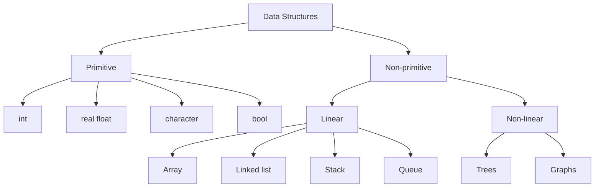

[🏠 Home](./README.md) | [Next ➡️](./pagecontext02.md)

---

# DSA Class Notes - Page Context 01 (Pages 001-005)

## Page 001
**Date:** 09 Nov, 2025  
**Instructor:** Foysal Sir  
**Course:** ECE-2103  
**Reference:** Data Structure with C by Seymour Lipschutz

### Chapter 1: Introduction to Data Structures

**Data Structures Classification Diagram:**


**Difference between `+=` and `=+`:**
- `+=`: Increments the value (e.g., `x += 1` adds 1 to x).
- `=+`: Assignment with positive sign (e.g., `x = (+y)`).

---

**Date:** 10 Nov, 2025  
**Instructor:** Foysal Sir  

**Data vs. Information:**
- **Data:** Unorganized quantities, characters, or symbols.
- **Information:** Organized data.
- **Flow:** `Data --[Structure]--> Information`

**Definition of Data:**  
The quantities, character, or symbol on which operations are performed by a system and which may be stored or transmitted into another system is called data.

---

## Page 002
**Topic:** Structure, ADT, and Pointers

**Example of Structure (Storage Concept):**
- Diagram showing a Parent `C` pointing to child nodes `F1`, `F2`, etc., which in turn point to individual files.

**Important Viva Question:**  
Difference between `struct`, `union`, and `enum`.

**Abstract Data Type (ADT):**
- **Definition:** A type whose behavior is defined by a set of values and operations.
- **Example (Stack):** Operations like `push()` and `pop()`.
- **Note:** "ভিতরে কি হয় জানিনা তবে use জানি" (We don't know the internal implementation, but we know how to use the operations).

---

**Date:** 12 Nov, 2025  
**Instructor:** Foysal Sir  

**Pointers:**
- Definition: Points to a particular memory address.
- Connection: There is a direct connection between the CPU and the memory unit.
- I/O Peripheral Device interaction mentioned.
- **Void Pointer:** A pointer where the data type is not predefined.

---

## Page 003
**Pointer Examples & Linked List Types**

**C Code Snippet (Void Pointer):**
```c
int n = 10;
void *ptr = &n;
// To print, typecast to int*
printf("%d", *(int*)ptr);
```

**Types of Pointers:**
- **Dangling Pointer:** A pointer pointing to a non-existing or already deallocated memory location.
- **NULL Pointer:** A pointer whose value is 0 (points to nothing).

**Linked List Classification Diagram:**
1. **Singly Linked List:** `[Head] -> [Data|Next] -> [Data|Next] -> [Tail|NULL]`
2. **Doubly Linked List:** `[Head] <-> [Prev|Data|Next] <-> [Prev|Data|Next] <-> [Tail]`
3. **Circular Linked List:** The last node points back to the Head node (contains a loop).

---

## Page 004
**Date:** 16 Nov, 2025  
**Instructor:** Foysal Sir  

### Single Linked List Implementation

**Logical Diagram:**
```
 Address: 1000         2000         3000
        [10 | 2000] -> [12 | 3000] -> [13 | NULL]
          ^
         Head
```

**Node Structure (C++ style syntax used in class):**
```cpp
class Node {
public:
    int data;
    Node* next;
    
    Node(int val) {
        data = val; // Note: classnote shows 'val = val' which is likely a typo for 'this->data = val'
        next = NULL;
    }
};
```

**Basic Main Function Logic:**
```cpp
main() {
    Node* head = new Node(10); // Creating first node
    head->next = NULL;
}
```

---

## Page 005
**Linked List Creation**

**Linked List Logic (Continued):**
- Creating a new node: `Node* newnode = new Node(val);`
- Initialization: `head = tail = newnode;`
- Setting termination: `newnode->next = NULL;`


<br>

---
[🏠 Home](./README.md) | [Next ➡️](./pagecontext02.md)
