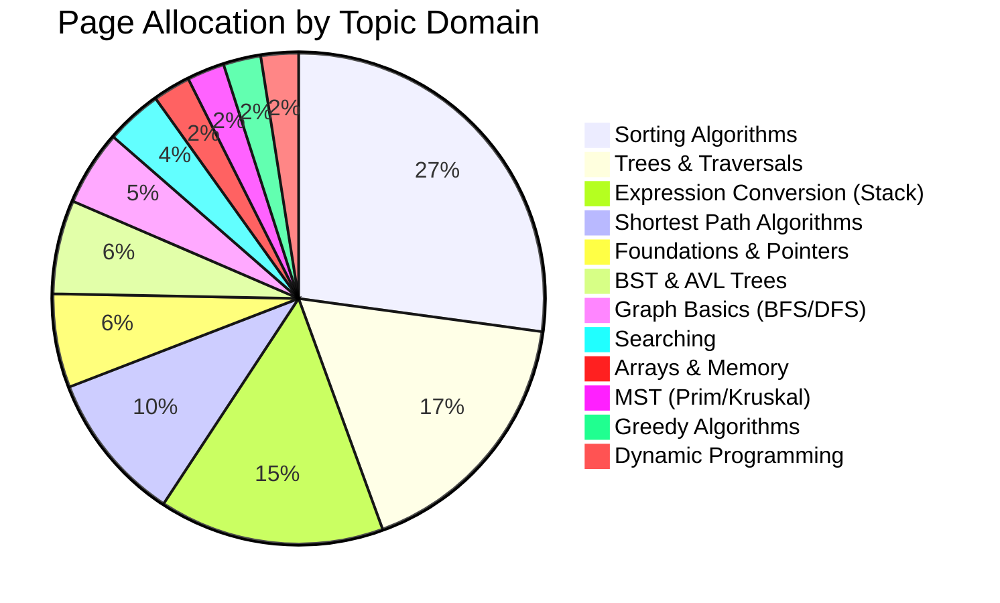

# 📊 DSA Class Notes — Comprehensive Analysis Report

**Course:** ECE-2103 (Data Structure & Algorithms)  
**Instructor:** Foysal Sir  
**Period:** November 2025 – April 2026  
**Total Pages Digitized:** 79 (across 16 context files)  
**Reference Textbook:** *Data Structure with C* by Seymour Lipschutz

---

## 1. Topic Coverage Map

The class notes span 12 major DSA domains. Below is a full inventory of every topic covered, mapped to page ranges and context files.

| # | Topic Domain | Pages | Context File(s) | Page Count |
|---|---|---|---|---|
| 1 | Foundations (DS Types, ADT, Pointers) | 001–005 | `01` | 5 |
| 2 | Arrays & Memory (Row/Col Major, Sparse Matrix) | 007–008 | `02` | 2 |
| 3 | Searching (Linear, Binary) | 009–011 | `02`, `03` | 3 |
| 4 | Sorting (Bubble, Insertion, Selection, Merge) | 012–033 | `03`–`07` | 22 |
| 5 | Stack Applications (Bracket Validity, Expression Conversion) | 021–042 | `05`–`09` | 12 |
| 6 | Trees (Terminology, Types, Traversals, Reconstruction) | 042–055 | `09`–`11` | 14 |
| 7 | BST & AVL Trees (Construction, Rotations) | 056–060 | `12` | 5 |
| 8 | Graphs (Adjacency Matrix, DFS, BFS) | 061–064 | `13` | 4 |
| 9 | Shortest Path (Dijkstra, Bellman-Ford) | 065–072 | `13`–`15` | 8 |
| 10 | MST (Prim's, Kruskal's) | 067–068 | `14` | 2 |
| 11 | Greedy Algorithms (Job Sequencing, Fractional Knapsack) | 073, 077 | `15`, `16` | 2 |
| 12 | Dynamic Programming (0/1 Knapsack) | 075–076 | `15`, `16` | 2 |

> [!NOTE]
> Pages 078–079 contain the instructor's own **Final Exam Roadmap** — not a new topic, but a prioritization guide.

---

## 2. Page Allocation by Topic (Visual Weight)

This shows how much lecture time (pages) the instructor dedicated to each domain, which is a strong signal for exam importance.

> [!IMPORTANT]
> **Sorting (22 pages)** and **Trees (14 pages)** together consume ~46% of the entire notes. These are the instructor's highest-emphasis areas.

---

## 3. Content Depth Analysis

### ✅ Topics With Strong Coverage (Exam-Ready)

| Topic | What's Provided | Readiness |
|---|---|---|
| **Bubble Sort** | Algorithm + Code + 3 traces + Complexity + Advantages/Disadvantages | ⭐⭐⭐⭐⭐ |
| **Insertion Sort** | Algorithm + Code + 2 traces + Complexity + Advantages/Disadvantages | ⭐⭐⭐⭐⭐ |
| **Selection Sort** | Algorithm + Code + 2 traces + Complexity + Advantages/Disadvantages | ⭐⭐⭐⭐⭐ |
| **Merge Sort** | Pseudocode + 2 traces + Divide/Conquer diagram + Complexity | ⭐⭐⭐⭐⭐ |
| **Infix→Postfix** | Full code + Rules + 3 trace examples | ⭐⭐⭐⭐⭐ |
| **Postfix→Infix** | Algorithm + Detailed trace | ⭐⭐⭐⭐ |
| **Infix→Prefix** | Algorithm (4-step method) + Trace | ⭐⭐⭐⭐ |
| **Prefix→Postfix** | Algorithm + 2 traces | ⭐⭐⭐⭐ |
| **Tree Traversals** | Preorder/Inorder/Postorder definitions + multiple traces | ⭐⭐⭐⭐⭐ |
| **Tree Reconstruction** | Algorithm + 3 worked examples | ⭐⭐⭐⭐⭐ |
| **Binary Tree Formulas** | All 4 Height↔Node formulas + Full/Complete/Perfect definitions | ⭐⭐⭐⭐⭐ |
| **AVL Tree** | Definition + BF formula + 4 rotation types + Construction trace | ⭐⭐⭐⭐ |
| **Dijkstra's Algorithm** | 2 complete traces with tables | ⭐⭐⭐⭐⭐ |
| **Bellman-Ford** | Algorithm + multi-iteration trace + negative cycle discussion | ⭐⭐⭐⭐ |
| **DFS & BFS** | Data structures used + 2 traces each | ⭐⭐⭐⭐ |
| **0/1 Knapsack** | DP table + recurrence formula + backtracking | ⭐⭐⭐⭐ |

### ⚠️ Topics With Gaps (Need Supplementation)

| Topic | What's Missing | Risk Level |
|---|---|---|
| **Quick Sort** | Listed but **NO trace, NO code, NO simulation** in notes | 🔴 **HIGH** |
| **Heap Sort** | Listed but **completely absent** from notes | 🔴 **HIGH** |
| **Hashing** | Mentioned in exam roadmap (p.079) but **zero content** in notes | 🔴 **HIGH** |
| **B-Tree** | Marked as "Need to see" in CT-3 syllabus (p.060) — **no content** | 🟡 MEDIUM |
| **Linked List Operations** | Only node creation covered; **no insert/delete/reverse code** | 🟡 MEDIUM |
| **Stack & Queue Implementation** | Only applications covered; **no push/pop/enqueue/dequeue code** | 🟡 MEDIUM |
| **Recursion & Backtracking** | Mentioned in exam roadmap but **no dedicated content** | 🟡 MEDIUM |
| **Prim's Algorithm** | Rules + MST properties given, but **no step-by-step trace table** | 🟡 MEDIUM |
| **Kruskal's Algorithm** | Edge sorting shown but **no cycle-detection walkthrough** | 🟡 MEDIUM |
| **Adjacency List** | Only Adjacency Matrix covered; **list representation absent** | 🟢 LOW |
| **Fractional Knapsack** | P/W ratio calculated but **selection trace incomplete** | 🟢 LOW |

> [!CAUTION]
> **Quick Sort** and **Heap Sort** are listed in the sorting methods enumeration (p.012) and are historically among the most frequently examined topics (2017–2024). Their complete absence from the notes is a critical gap.

---

## 4. Code / Pseudocode Inventory

The following algorithms have actual C/C++ code or pseudocode in the notes:

| Algorithm | Code Type | Location |
|---|---|---|
| Linear Search | C code | `02` (p.009) |
| Binary Search (Recursive) | C code | `03` (p.011) |
| Bubble Sort | C code | `03` (p.013), `06` (p.026) |
| Insertion Sort | C code | `04` (p.017), `06` (p.029) |
| Selection Sort | C code | `07` (p.031) |
| Merge Sort | Pseudocode | `04` (p.019) |
| Infix→Postfix (Precedence fn) | C code | `08` (p.036–037) |
| Linked List Node Structure | C++ class | `01` (p.004) |

> [!WARNING]
> There is **no code** for: Quick Sort, Heap Sort, DFS, BFS, Dijkstra, Bellman-Ford, Prim's, Kruskal's, Stack/Queue ADT, or BST operations. The instructor's exam roadmap (p.078) explicitly states: *"Be prepared to write pseudocode for all algorithms."*

---

## 5. Instructor's Exam Roadmap (Pages 078–079)

The instructor provided an explicit breakdown of expected exam content:

### Section A (Shorter Answers)
1. All algorithms → pseudocode + examples
2. **Linked List** → memory calculation, types (Singly/Doubly/Circular)
3. **Stack & Queue** → step-by-step operations + pseudocode
4. **Sorting** → Focus on Merge Sort & Quick Sort; comparison analysis

### Section B (Longer Answers)
1. **Trees** → Height/Level calculation + all traversals
2. **Graphs** → BFS, DFS, Dijkstra, Bellman-Ford, Prim's, Kruskal's, Adjacency Matrix
3. **Hashing** → from assignments
4. **Recursion & Backtracking** → core concepts

---

## 6. Chronological Coverage Timeline

| Date | Pages | Topics Introduced |
|---|---|---|
| 09–12 Nov 2025 | 001–004 | DS Classification, ADT, Pointers, Linked List Intro |
| 16–19 Nov 2025 | 004–008 | Linked List Creation, Array Memory, Sparse Matrix |
| 23–24 Nov 2025 | 009–012 | Linear Search, Binary Search, Sorting Methods Intro |
| 26–30 Nov 2025 | 012–020 | Bubble Sort, Insertion Sort, Selection Sort, Merge Sort |
| 07 Dec 2025 | 021–025 | Stack Applications, Expression Conversion Intro |
| 03–04 Jan 2026 | 036–040 | Infix→Postfix Code, Infix→Prefix |
| 10–13 Jan 2026 | 041–050 | Prefix→Postfix, Tree Terminology, Binary Tree Formulas |
| 22 Jan 2026 | 051–055 | Tree Traversals, Tree Reconstruction |
| 25–28 Jan 2026 | 056–060 | AVL Tree, BST, CT-3 Syllabus |
| 29–30 Mar 2026 | 061–066 | Graphs, DFS, BFS, Dijkstra |
| 01 Apr 2026 | 067–068 | Prim's, Kruskal's |
| 05–06 Apr 2026 | 069–072 | Bellman-Ford, Negative Cycles |
| 12–13 Apr 2026 | 073–077 | Job Sequencing, 0/1 Knapsack, Fractional Knapsack |
| Final Lecture | 078–079 | Exam Roadmap (Section A & B) |

> [!NOTE]
> There is a notable **~2-month gap** between Dec 2025 and Jan 2026, and another **~2-month gap** between Jan and Mar 2026 (likely winter break and mid-semester exams). Graph algorithms were compressed into the final 2 weeks.

---

## 7. Exam Preparation Priority Matrix

Based on page allocation, instructor emphasis (exam roadmap), and historical exam frequency (2017–2024 papers):

| Priority | Topic | Notes Status | Action Required |
|---|---|---|---|
| 🔴 Critical | Quick Sort | ❌ Missing | **Study from textbook/external notes** |
| 🔴 Critical | Heap Sort / Heap Operations | ❌ Missing | **Study from textbook/external notes** |
| 🔴 Critical | Hashing (Chaining, Linear Probing) | ❌ Missing | **Study from assignments** |
| 🔴 Critical | Dijkstra's Algorithm | ✅ Complete | Review traces |
| 🔴 Critical | BST (Insert/Delete) | ⚠️ Partial | **Add deletion algorithm** |
| 🔴 Critical | Prim's & Kruskal's | ⚠️ Partial | **Add detailed trace tables** |
| 🟡 High | BFS & DFS | ✅ Complete | Review traces |
| 🟡 High | Stack (Infix→Postfix) | ✅ Complete | Practice with new expressions |
| 🟡 High | Tree Traversals & Reconstruction | ✅ Complete | Practice with new trees |
| 🟡 High | Bellman-Ford | ✅ Complete | Review negative cycle case |
| 🟡 High | Linked List Operations | ⚠️ Partial | **Add insert/delete/reverse** |
| 🟡 High | 0/1 Knapsack | ✅ Complete | Review DP table construction |
| 🟢 Moderate | Merge Sort | ✅ Complete | Quick review |
| 🟢 Moderate | Bubble/Insertion/Selection Sort | ✅ Complete | Quick review |
| 🟢 Moderate | Recursion & Backtracking | ❌ Missing | **Study Tower of Hanoi, N-Queens** |
| 🟢 Moderate | B-Tree | ❌ Missing | **Study if time permits** |

---

## 8. Key Formulas Quick-Reference

From the notes, these formulas should be memorized:

### Arrays
- **Row Major:** $\text{Addr}(A[i,j]) = B + w \times \{n(i - LBR) + (j - LBC)\}$
- **Column Major:** $\text{Addr}(A[i,j]) = B + w \times \{m(j - LBC) + (i - LBR)\}$

### Binary Trees
- Max nodes for height $H$: $n = 2^{H+1} - 1$
- Min nodes for height $H$: $n = H + 1$
- Max height for $n$ nodes: $H = n - 1$
- Min height for $n$ nodes: $H = \log_2(n+1) - 1$
- Full BT leaf count: $L = I + 1$

### AVL Tree
- $BF = H(\text{Left}) - H(\text{Right})$, must be $\in \{-1, 0, 1\}$

### MST
- Edges in MST: $E' = |V| - 1$

### 0/1 Knapsack
- $V[i,w] = \max(V[i-1,w],\ P_i + V[i-1, w - w_i])$

### Bellman-Ford
- Required iterations: $n - 1$

---

## 9. Summary & Recommendations

### Strengths of the Notes
- Excellent **step-by-step traces** for sorting, expression conversion, and Dijkstra
- Good **code coverage** for sorting algorithms and expression conversion
- Strong **tree foundations** with formulas and reconstruction examples
- Instructor's own exam roadmap provides clear direction

### Critical Actions Before Exam
1. **Fill the Quick Sort gap** — this appears in nearly every past paper
2. **Study Heap Sort and Heap operations** — frequently examined
3. **Review Hashing** from assignment materials — confirmed by instructor
4. **Write pseudocode** for DFS, BFS, Dijkstra, Prim's, Kruskal's, and BST delete
5. **Practice Recursion** problems (Tower of Hanoi, N-Queens)
6. **Complete Linked List operations** (insert at position, delete, reverse)
